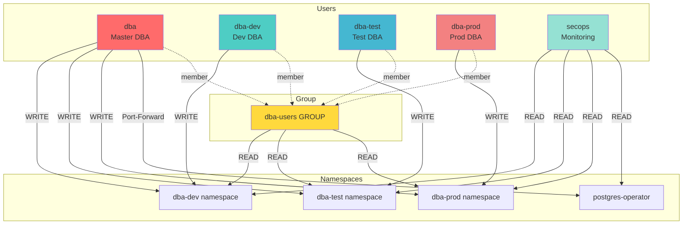
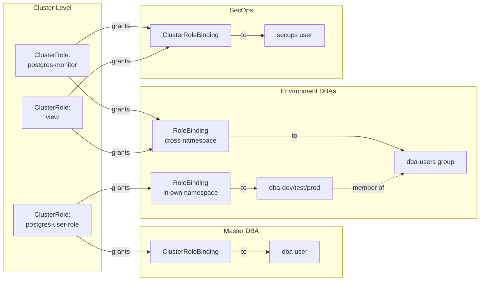
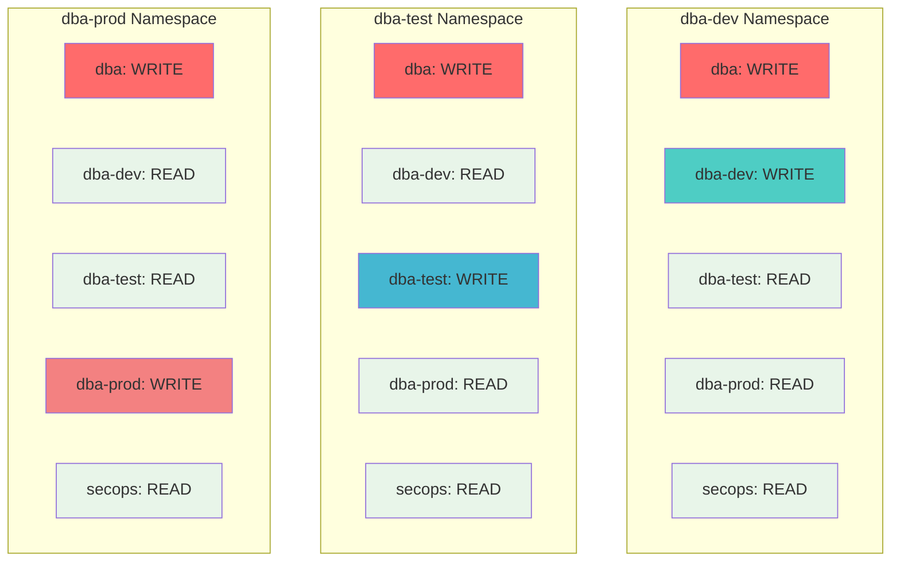
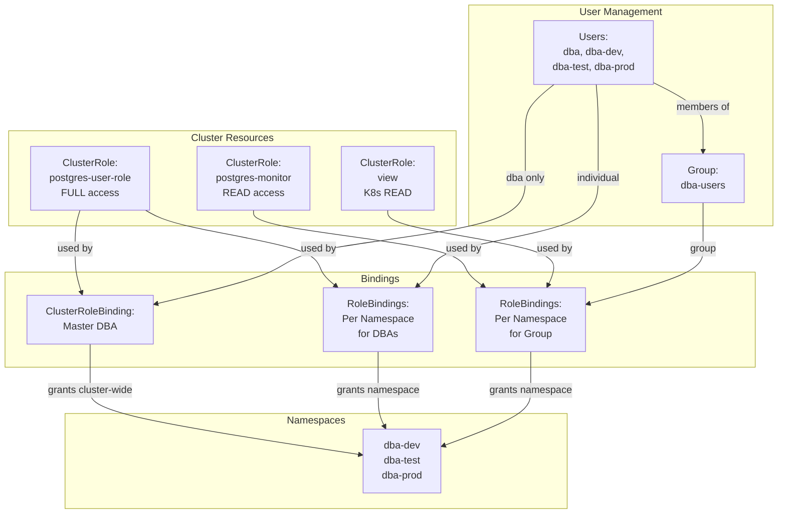

# RBAC Visual Diagrams

## Quick Reference: User Permissions



## Permission Inheritance Flow



## Permission Levels by Namespace



## RBAC Resource Relationships



## Access Summary Table

| User | Cluster-Wide | dba-dev | dba-test | dba-prod | postgres-operator |
|------|-------------|---------|----------|----------|-------------------|
| **dba** | PostgreSQL CRUD<br/>View all | READ/WRITE | READ/WRITE | READ/WRITE | Port-forward |
| **dba-dev** | View all (group)<br/>PostgreSQL READ (group) | READ/WRITE | READ | READ | - |
| **dba-test** | View all (group)<br/>PostgreSQL READ (group) | READ | READ/WRITE | READ | - |
| **dba-prod** | View all (group)<br/>PostgreSQL READ (group) | READ | READ | READ/WRITE | - |
| **secops** | View all<br/>PostgreSQL READ<br/>Pod logs | READ | READ | READ | READ |

**Legend:**
- **WRITE** = Create, Update, Delete PostgreSQL clusters
- **READ** = View resources only
- **(group)** = Permission inherited via dba-users group membership

## Key Security Features

```
┌─────────────────────────────────────────────────────────────┐
│  WRITE Isolation (Can modify databases)                    │
├─────────────────────────────────────────────────────────────┤
│  • dba         → ALL namespaces (Master DBA)                │
│  • dba-dev     → dba-dev only                               │
│  • dba-test    → dba-test only                              │
│  • dba-prod    → dba-prod only                              │
└─────────────────────────────────────────────────────────────┘

┌─────────────────────────────────────────────────────────────┐
│  READ Visibility (Can view for troubleshooting)             │
├─────────────────────────────────────────────────────────────┤
│  • dba-users group → ALL dba-* namespaces                   │
│  • secops          → ALL namespaces (monitoring)            │
└─────────────────────────────────────────────────────────────┘

┌─────────────────────────────────────────────────────────────┐
│  Special Access                                              │
├─────────────────────────────────────────────────────────────┤
│  • dba → Port-forward to PostgreSQL Operator UI             │
└─────────────────────────────────────────────────────────────┘
```
